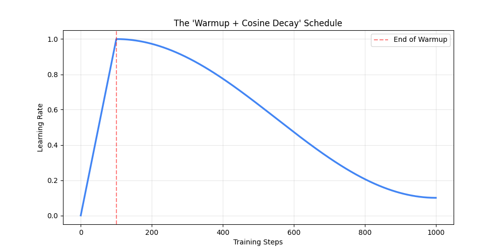

# Training Stability (Batches & Schedulers)

## 1\. Gradient Accumulation (The "Virtual" Batch Size)

### The Problem: The "Out Of Memory" (OOM) Wall

Research papers often say: *"We trained with a batch size of 128."*
You try to run `batch_size=128` on your laptop or gaming GPU, and PyTorch immediately crashes with:
`CUDA out of memory. Tried to allocate 2.4GB...`

**Why?**
Batch Size 128 means loading 128 sentences, 128 sets of intermediate activations, and 128 sets of gradients into VRAM simultaneously. Your hardware simply isn't big enough.

### The Solution: Gradient Accumulation

We can cheat. Instead of processing 128 samples at once, we process them in small chunks (micro-batches) but **wait** to update the model until we have finished all chunks.

**The Waiter Analogy:**

* **Standard Training:** A waiter takes 1 order, runs to the kitchen, gives the order. Runs back, takes 1 order, runs to the kitchen. (Inefficient).
* **Gradient Accumulation:** A waiter takes 4 orders (accumulates them in a notepad), then runs to the kitchen **once** to submit all 4 orders together.

### The Process

1. **Forward/Backward (Batch 1 of 32):** Calculate gradients. **Do not update weights.**
2. **Forward/Backward (Batch 2 of 32):** Calculate gradients. Add them to the previous ones.
3. **Forward/Backward (Batch 3 of 32):** Calculate gradients. Add them.
4. **Forward/Backward (Batch 4 of 32):** Calculate gradients. Add them.
5. **Optimizer Step:** Now that we have the accumulated gradient of 128 samples ($32 \times 4$), we update the weights.
6. **Zero Grad:** Clear the buffer.

### The Math

$$Batch_{Effective} = Batch_{PerDevice} \times Steps_{Accum} \times Num_{Devices}$$

* **Scenario:** You have 1 GPU. It can only fit a batch size of 32. You want the stability of Batch Size 128.
* **Math:** $32 \times \mathbf{4} = 128$.
* **Action:** You set `accumulate_grad_batches=4`.

**Trade-off:** It does **not** make training faster (you still calculate 128 items). It just allows you to fit large batch mathematics into small memory.

-----

## 2\. The Scheduler (Warmup + Cosine) (The Speed Control)

If the Optimizer is the engine, the **Scheduler** is the gas pedal. You should not keep your foot on the gas at 100% the entire time.

### The "Violent" Beginning (Why we need Warmup)

At Step 0, your model is initialized with random numbers. It knows nothing.

* If you feed it data, the error (Loss) will be massive.
* Massive Loss = Massive Gradients.
* **The Risk:** If your Learning Rate (LR) is high (e.g., $3e^{-4}$) right away, these massive gradients will "kick" the weights so hard they break (values become NaN or the model gets stuck in a bad state).

### The Strategy: Warmup + Cosine Decay

#### Phase 1: Linear Warmup ("The Gentle Start")

Instead of starting at Max Speed, we start at 0 and linearly accelerate over the first few steps (e.g., 1,000 steps).

* **Goal:** Let the gradients align and stabilize before we start running fast.
* **Analogy:** An airplane slowly accelerating on the runway before taking off.

#### Phase 2: Cosine Decay ("The Soft Landing")

Once we reach Max Speed (Max LR), we immediately start slowing down. We follow a **Cosine Curve** (a smooth wave shape) down to 10% of the max speed.

* **Goal:**
  * *High LR (Mid-training):* Jump over rough terrain and find the general area of the solution.
  * *Low LR (End-training):* We are now close to the answer. We need to slow down to settle into the precise bottom of the error valley without overshooting it.
* **Analogy:** Slowing down the car as you try to park in a tight spot.

### Visualizing the Schedule

Below is the exact shape of the Learning Rate over time that dominates modern LLM training.

```python
import matplotlib.pyplot as plt
import numpy as np

# Parameters
total_steps = 1000
warmup_steps = 100
max_lr = 1.0
min_lr = 0.1

# Generate steps
steps = np.arange(total_steps)
lrs = []

for t in steps:
    if t < warmup_steps:
        # Linear Warmup: 0 -> Max
        lr = max_lr * (t / warmup_steps)
    else:
        # Cosine Decay: Max -> Min
        progress = (t - warmup_steps) / (total_steps - warmup_steps)
        cosine_decay = 0.5 * (1 + np.cos(np.pi * progress))
        lr = min_lr + (max_lr - min_lr) * cosine_decay
    lrs.append(lr)

# Plotting
plt.figure(figsize=(10, 5))
plt.plot(steps, lrs, linewidth=2.5, color='#4285F4')
plt.title("The 'Warmup + Cosine Decay' Schedule")
plt.xlabel("Training Steps")
plt.ylabel("Learning Rate")
plt.axvline(x=warmup_steps, color='r', linestyle='--', alpha=0.5, label='End of Warmup')
plt.legend()
plt.grid(True, alpha=0.3)

# Saving the plot
plt.savefig("scheduler_plot.png")
```



-----

### Summary Checklist

| Concept | Problem Solved | How it works |
| :--- | :--- | :--- |
| **Gradient Accumulation** | GPU Memory is too small for large batches. | Wait to update weights until multiple small batches are processed. |
| **Linear Warmup** | Early training is unstable; gradients explode. | Start LR at 0, slowly increase to Max to let model stabilize. |
| **Cosine Decay** | High LR at the end of training prevents fine-tuning. | Smoothly lower LR to \~10% to settle into the optimal solution. |
